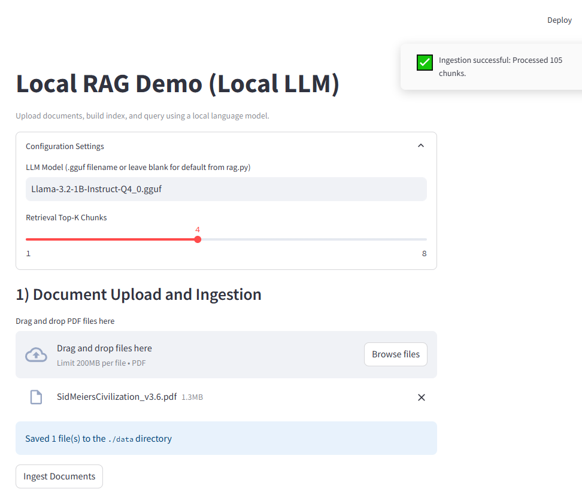
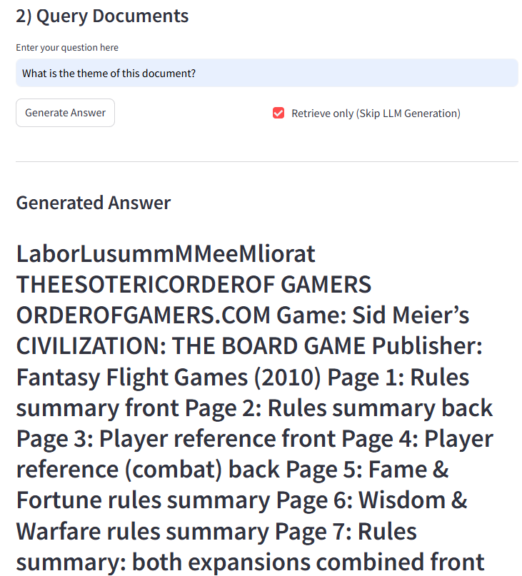
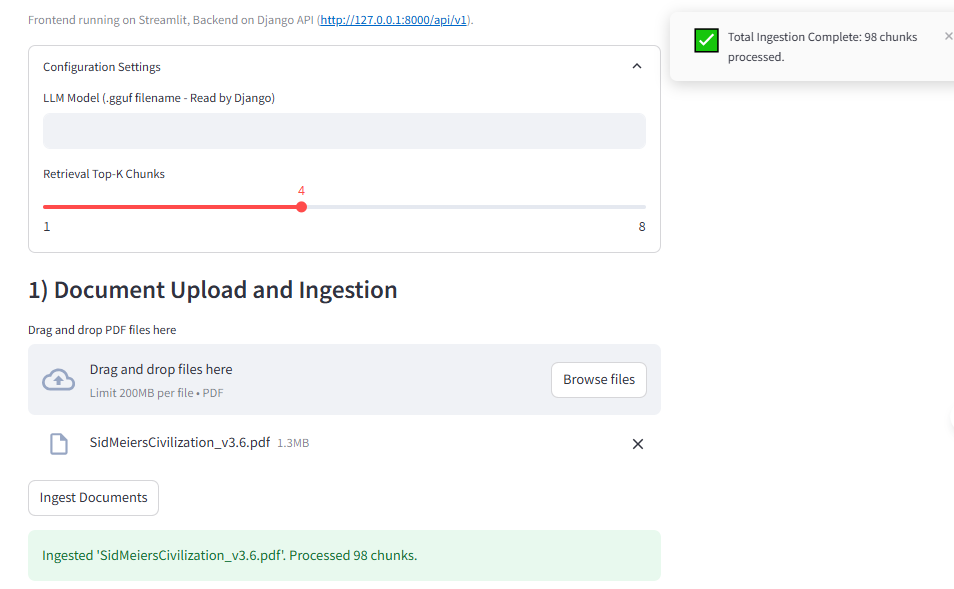
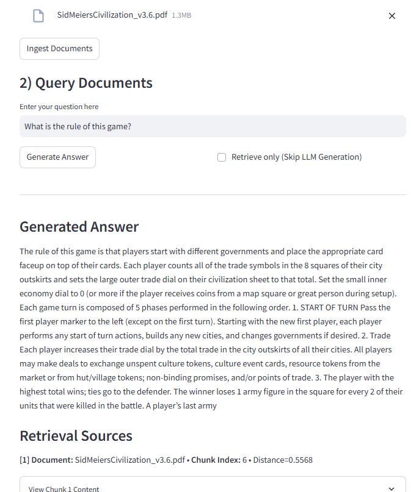
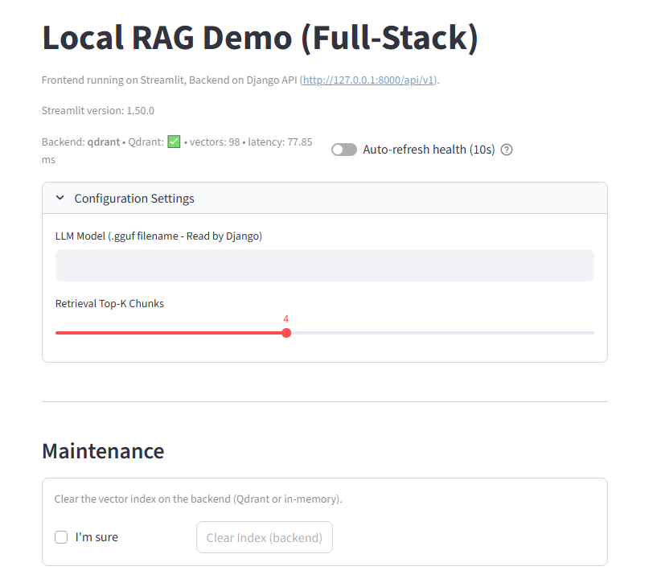
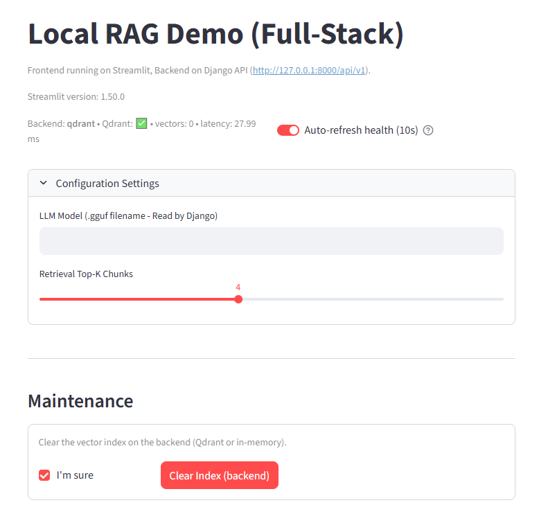
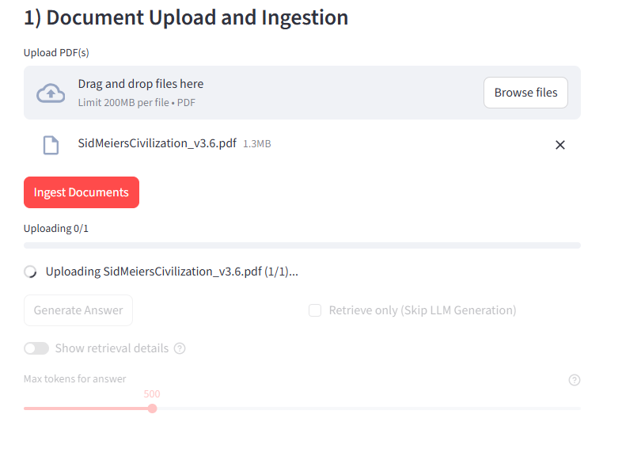
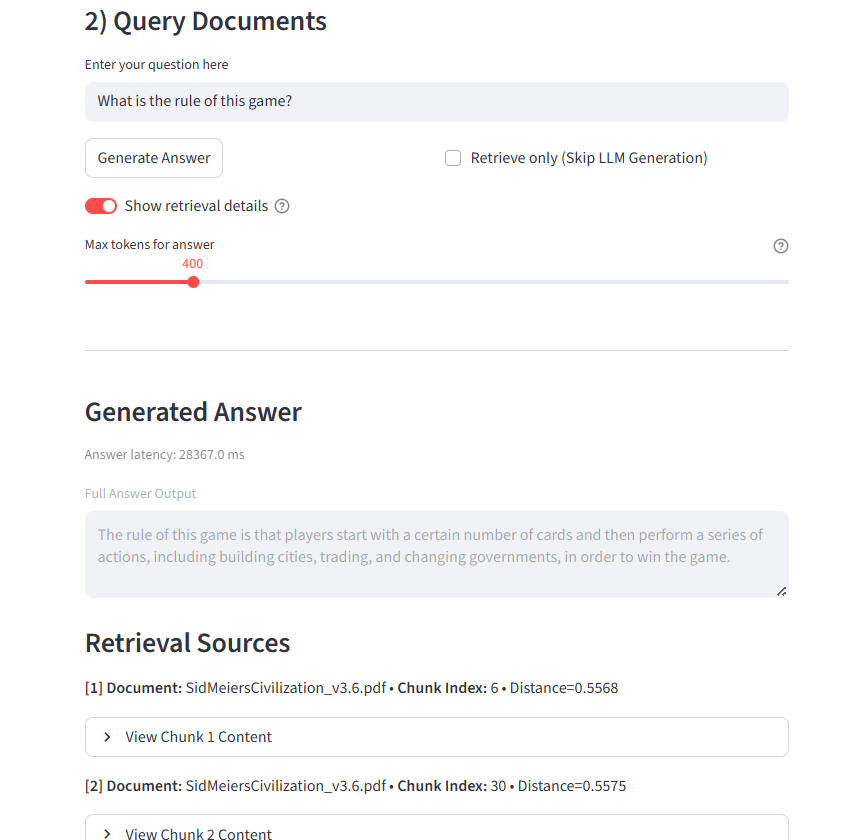
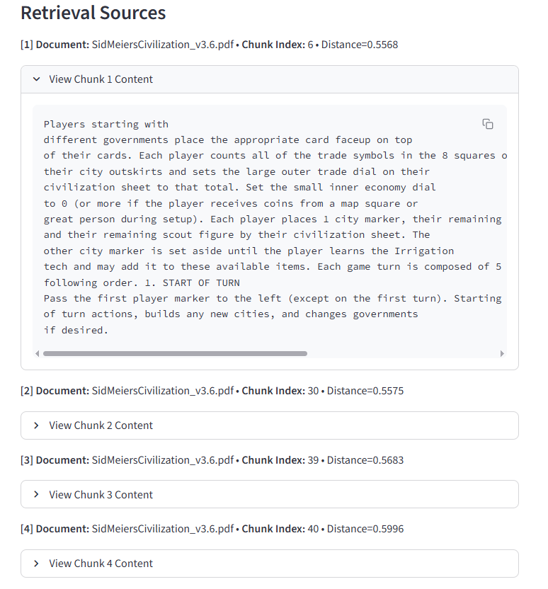

# AI RAG Demo (Local LLM Service)

A minimal, secure Retrieval-Augmented Generation (RAG) system built entirely from scratch in Python, focused on running inference and retrieval locally and offline.  
The core logic is exposed via a dedicated Django REST API service.

---

## Core Components

- **Embeddings:** `sentence-transformers` (`all-MiniLM-L6-v2`)
- **Vector Store:** Custom implementation using `NumPy` and `scikit-learn` (`NearestNeighbors`) for memory-based indexing (persisted in `./db`).
- **Generator:** Local LLM inference via `llama-cpp-python` (default model: `Llama-3.2-1B-Instruct-Q4_0.gguf`).

---

## Quickstart & Setup

### A. Backend Service (Django REST API)

This is the core component that handles ingestion, retrieval, and LLM generation.

```bash
# 1. Preparation
# Place your desired GGUF model file (e.g., Llama-3.2-1B-Instruct-Q4_0.gguf) in the project root directory.

# 2. Install Dependencies
pip install -r requirements.txt
pip install -r requirements-web.txt

# 3. Run Service
# Start the Django development server (run this in Terminal 1)
python manage.py runserver
```

---

### B. Command Line Interface (CLI)

Used for direct backend testing or initial indexing.

```bash
# 1. Ingest PDF documents and build the index (index files saved to ./db)
python main.py ingest data/*.pdf

# 2. Ask a question based on your indexed documents
python main.py ask "What is the document about?"
```

---

## Web UI (Streamlit Frontend)

A simple, local web interface for interacting with the Django Backend Service.

- Displays **end-to-end query latency** (answer generation time)
- Optional **retrieval inspector toggle** to show top-K retrieved chunks with scores and sources


### Adjustable Answer Length (max_tokens)

The Streamlit interface now allows adjusting the **LLM answer length** per query using a
*Max Tokens* slider (200–1500). Full-length answers are displayed without truncation,
and the actual token usage is reported in the debug panel below the response:

- `payload.max_tokens_sent` → slider value
- `backend.used.max_tokens` → actual tokens generated
- `backend.used.answer_len` → length of final answer

---
 ### CLI Support
```bash
# 1. Start Backend
# Ensure the Django service is running (see section A above)

# 2. Run Frontend
# Launch the Streamlit application (run this in Terminal 2)
streamlit run streamlit_app.py
```

Note: The Streamlit client uses the Python `requests` library to communicate via HTTP with the Django API.

---


### Multi-PDF Upload & Progress

The Streamlit frontend now supports **batch uploading multiple PDFs** to the backend in one click, with:

- Sequential upload and ingestion of each file  
- Real-time progress bar and per-file success/failure toast notifications  
- Automatic refresh of the top-bar health banner (showing updated vector count and latency)
- Support for uploading multiple PDFs with progress feedback and per-file toasts

Example workflow:
1. Select multiple PDFs in the upload area.  
2. Click **“Ingest Documents”** → see a global progress bar update (0 → 100 %).  
3. After ingestion, the **health badge** reflects the new `vectors` count immediately.  


---
## Demo Screenshots

<details>
<summary><b>📸 Click to view updated UI screenshots</b></summary>

<p align="center">
  <br>
</p>

<p align="center">
  <br>
</p>

<p align="center">
  <br>
</p>

<p align="center">
  <br>
</p>

<p align="center">
  <br>
</p>

<p align="center">
  <br>
</p>

<p align="center">
  <br>
</p>

<p align="center">
  <br>
</p>

<p align="center">
  <br>
</p>

<p align="center">
  <br>
</p>


</details>
---

## RAG API Endpoints (Django REST Framework)

The RAG core logic is exposed as a fully decoupled RESTful service.

```
Base URL: http://127.0.0.1:8000/api/v1/
```

---

### 1. Ingest Documents

Processes PDF files, chunks them, embeds them, and updates the local vector index.

```
Endpoint: /api/v1/ingest/
Method: POST
Content Type: multipart/form-data
Required Field: pdf_file (File)
```

---

### 2. Query Documents

Performs semantic retrieval and LLM answer generation.

```
Endpoint: /api/v1/query/
Method: POST
Content Type: application/json
Required Fields:
  - query (str)
Optional Fields:
  - k (int)
  - generate (bool)
```

---

## Qdrant (Dockerized Vector Database Integration)

An optional backend extension for **persistent vector storage** using **[Qdrant](https://qdrant.tech)** — a high‑performance vector search engine.  
This complements the default in‑memory index and enables scalable, durable ANN search.

### 1) Run Qdrant (Docker)
```bash
docker run -d --name qdrant   -p 6333:6333 -p 6334:6334   -v qdrant_data:/qdrant/storage   qdrant/qdrant
# If port 6333 is taken, map to another host port, e.g. -p 16333:6333
```

### 2) Enable Qdrant in this project (env variables)
**Windows (PowerShell):**
```powershell
$env:RAG_STORAGE="qdrant"
$env:QDRANT_URL="http://127.0.0.1:6333"   # or http://127.0.0.1:16333 if remapped
$env:QDRANT_COLLECTION="chunks"
$env:EMBED_DIM="384"
```

**macOS/Linux (bash/zsh):**
```bash
export RAG_STORAGE=qdrant
export QDRANT_URL=http://127.0.0.1:6333
export QDRANT_COLLECTION=chunks
export EMBED_DIM=384
```

### 3) Verify connectivity (optional local script)
```bash
python qdrant_try.py
```
Expected output:
```
upsert ok: {...}
search result: {...}
```

### 4) Ingest & Query (CLI)
```bash
# Ingest PDFs (writes vectors to Qdrant)
python main.py ingest data/*.pdf

# Retrieve only (skip generation) — quicker for testing
python main.py ask "What is the document about?" --no-generate --show-snippets

# Full RAG with local LLM (llama-cpp)
python main.py ask "What is the document about?" --k 4
```

### 5) How it works (internal)
- When `RAG_STORAGE=qdrant`, the backend writes/reads vectors via `rag_backend/storage_qdrant.py`.
- Retrieval returns payload fields `doc_id`, `chunk_idx`, and `text`. CLI maps these to `Sources`.

### 6) Troubleshooting
- **400 Bad Request on upsert** → Point `id` must be **UUID or unsigned integer**. The adapter auto‑generates UUIDs; custom IDs are stored as `payload.qid`.
- **Vector size mismatch** → Ensure the collection is `size=384`. Delete and recreate if needed:
  ```bash
  curl -X DELETE http://127.0.0.1:6333/collections/chunks
  ```
- **No sources / meta=None** → Ensure search request includes `"with_payload": true` and the CLI reads `meta.doc_id / meta.chunk_idx`.

### 7) Switch back to in‑memory (dev mode)
```bash
# Unset the variable or set to "memory"
$env:RAG_STORAGE="memory"   # PowerShell
# or
export RAG_STORAGE=memory   # bash/zsh

> Optional: set `RESET_ON_STARTUP=true` to auto-clear the Qdrant collection on backend start.

```

---

## Qdrant Vector Storage + Django REST API Integration

This update completes the **retrieval and generation pipeline** for the local RAG demo, fully connecting:
- **Qdrant vector database** (running via Docker)
- **Django REST backend** (`rag_api`)
- **Local LLM inference** powered by `llama-cpp-python`

### Key Updates

#### 1. Qdrant Storage Adapter
Added `rag_backend/storage_qdrant.py` and `storage_factory.py`, supporting:
- Persistent vector storage via **Qdrant REST API**
- Collection auto-creation with 384-dimensional cosine distance
- Upsert and search interfaces integrated with `RAGService`

#### 2. API Endpoints
Updated `rag_api/views.py` and `urls.py`:
- `POST /api/v1/ingest/` — Upload & embed PDF files  
- `POST /api/v1/query/` — Retrieve + generate LLM answers  
- `POST /api/v1/query_retrieve/` — Retrieve-only mode (for frontend debugging)  
- `GET /api/v1/health/` — Storage backend and Qdrant status check  
- `POST /api/v1/clear/` — Reset the vector index

Example (PowerShell):
```powershell
$body = @{ query = "Sid Meier"; k = 4 } | ConvertTo-Json
Invoke-RestMethod -Method Post -Uri "http://127.0.0.1:8000/api/v1/query_retrieve/" -Body $body -ContentType "application/json"
```

#### 3. Environment Configuration
Make sure the backend recognizes Qdrant:
```powershell
$env:RAG_STORAGE="qdrant"
$env:QDRANT_URL="http://127.0.0.1:6333"
$env:QDRANT_COLLECTION="chunks"
$env:EMBED_DIM="384"
python manage.py runserver
```

#### 4. Validation Results
```text
[Query] "Sid Meier"  → success (retrieved relevant chunks)
[Query] "What is the document about?" → success (generated answer)
[Health] → status: ok, storage: qdrant
```

### Health Status API (`GET /api/v1/health/`)
Reports backend availability and Qdrant connection status.

- Returns JSON with backend storage type, Qdrant collection info, and alive flag  
- Used by the Streamlit frontend for real-time health monitoring  
- Also returns `latency_ms` and `qdrant.points_count` for the health banner
- Example:
  ```powershell
  Invoke-RestMethod http://127.0.0.1:8000/api/v1/health/ | ConvertTo-Json
  # → {
  #     "status": "ok",
  #     "storage": "qdrant",
  #     "latency_ms": 3.2,
  #     "qdrant": { "alive": true, "points_count": 98, ... }
  #   }
  ```


### Clear Index API (`POST /api/v1/clear/`)
A new backend endpoint for resetting the vector index has been added. Supports both Qdrant and in-memory modes; typically used after testing ingestion to reset the index.

- **Qdrant mode:** Drops and recreates the existing collection via REST API  
- **Memory mode:** Clears in-memory vectors and embeddings  
- Verified via PowerShell:
  ```powershell
  Invoke-RestMethod -Method POST http://127.0.0.1:8000/api/v1/clear/ | ConvertTo-Json
  # → { "status": "success", "result": { "ok": true, "collection": "chunks", "reset": true } }

### Summary
- Integrated **Qdrant** as the vector store backend  
- Extended Django REST API endpoints for ingestion and querying  
- Verified end-to-end retrieval and answer generation  
- Confirmed compatibility with PowerShell (`Invoke-RestMethod`)  

---

## Notes

- All operations (embedding, retrieval, generation) run fully locally; the vector index is stored under `./db/` and reused across sessions.
- The GGUF model must be downloaded separately and placed in the project root.
- AI coding assistants were used as auxiliary tools (debugging/refactoring/boilerplate), while architecture and final changes were authored and validated by me.

