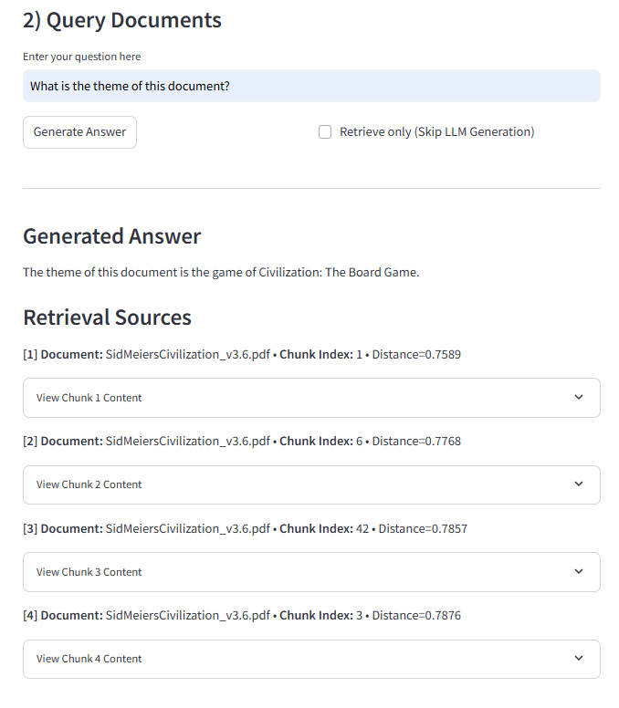

AI RAG Demo (Local with LLM)
A minimal Retrieval-Augmented Generation (RAG) system built entirely from scratch in Python, focused on running inference and retrieval locally.

🔬 Core Components:
Embeddings: sentence-transformers (all-MiniLM-L6-v2)

Vector Store: Custom implementation using NumPy and scikit-learn (NearestNeighbors) for memory-based indexing (persisted in ./db).

Generator: Local LLM inference via llama-cpp-python (default model: Llama-3.2-1B-Instruct-Q4_0.gguf).

Quickstart (CLI)
You must first place your desired GGUF model file (e.g., Llama-3.2-1B-Instruct-Q4_0.gguf) in the project root directory to ensure the generator can find it.

# 1. Ingest PDF documents and build the index (index files saved to ./db)
python main.py ingest data/*.pdf

# 2. Ask a question based on your indexed documents
python main.py ask "What is the document about?"

Web UI (Streamlit)
A simple, local web interface for non-technical users, featuring document upload, ingestion, and querying.

Setup and Run
Ensure all dependencies are installed (requires streamlit and llama-cpp-python dependencies):

pip install -r requirements.txt

Run the Streamlit application:

streamlit run streamlit_app.py

Use the UI to upload PDF documents, click Ingest Documents, and then enter a query in the "Query Documents" section. Important: The LLM generator will only work if the specified GGUF model file is placed in the project root directory.

Demo Sreenshots

